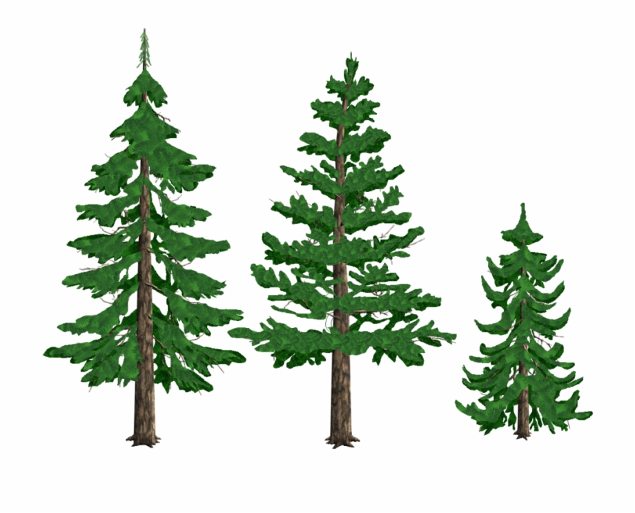

# National Park Plaza
#### 4WWC3 Web Project

**https://nationalparkplaza.ga/**

The term project for course 4WW3 (Web Systems and Web Computing). 

This site will allow users to browse and submit reviews for national parks.

## Collaborators:
* Jiuwei Wang (400061882) - Enrolled in 4WW3
 *MacID: wangj160*<br/> 
 *Git User Name: WebProject4WW3*<br/>
 *email: wangj160@mcmaster.ca*
* Vanessa Truong (400023632) - Enrolled in 4WW3
 *MacID: truonv1*<br/>
 *Git User Name: nessa-art*<br/>
 *email: truonv1@mcmaster.ca*

The following is a rundown of answers for our completed Add-on Task 2.

## Add-on Task 2 
### Part i) 
The <picture> tag was incorporated in the sample object page, 'Bruce Peninsula National Park' under the 'National Parks' tab. There is an acorn logo at the top-right
corner of the webpage that will alternate between resizings as follows:
- 2 acorns (assets/acorn_2.jpg) when min-width is 800px
- 1 acorn (assets/acorn.jpg) in default case 

The following code handles this:

```html
<picture class="acorn-logo" style="float:right">	
	<source media="(min-width: 800px)" srcset="assets/acorn_2.jpg">
	
</picture>
```

There are 3 different <source> attributes that the 'Search' page will present with screen resizing:
- A black and white forest stencil (assets/search-tree-4.jpg) when min-width is 800px
- A watercolour forest art piece (assets/search-tree-3.jpg) when min-width is 470px
- An image of 3 trees (search-tree.jpg) in default case

The following is the code that handles this:

```html
<picture>
	<source media="(min-width: 800px)" srcset="assets/search-tree-4.jpg">	
        <source media="(min-width: 470px)" srcset="assets/search-tree-3.jpg">
        
</picture>
```

There are 2 <source> attributes representing the 2 responsive images that the browser will use depending on the 'media' constraints defined, and an  attribute 
that represents the image the browser will fall back to if the former <source> tag isn't supported. 

The <source> tags will present the images if the requirement specified by the 'media' attribute are satisfied. This would mean that the image 'search-tree-4.jpg' will only be shown in the browser if the media condition 'min-width: 800px' is satisfied, and the image 'search-tree 3.jpg' will be shown if the media condition 'min-width: 470px' is satisfied. The  tag represents the image that will be shown if the 'media' conditions for both sources above can not be satisfied, or if support for <source> tag is not available on the browser.

### Part ii)
Three positive goals that can be achieved through using <picture> and <source> attributes:

1. **You can dynamically resize images to fit screens of all sizes.** If you have the same image in multiple sizes, you can choose to present each image under 
different screen sizes conditions. Hence, when you're viewing an image on a laptop versus an image on a smaller tablet, the image can appear to dynamically 
adapt to the screen's proportion.

2. **You can showcase more image than one.** If you have multiple 'source' attributes under theh 'picture' tag, you can set a different image for every source, so that
the webpage presents a different image with different resizing. This can create the allusion of a stop-motion animation and can be used creatively.

3. **You can adjust the orientation of the picture.** The <source> tag has an attribute that allows you to orient your images a different way. This avoids the hassle 
of having to orient the picture using an editor. 

### Part iii)
A negative aspect of using <picture> and <source> is that if a developer is using it for the purposes of presenting the same image but at different resolutions,
they would need to create multiple versions of that image in different resolutions, and link all of them separately in their own <source> tags. Ideally, it would be
more efficient if the developer only has to upload one version of the photo (a high resolution version) and HTML can dynamically resize the image based on the developer's
commands for min-max constraints of the viewport. 

A workaround for this would be to just use CSS styling's @media queries to resize the  based on the specified screen constraints. This is a demonstration of how
using css styling is a better alternative as opposed to using HTML's styling, which is very limited.  

 
